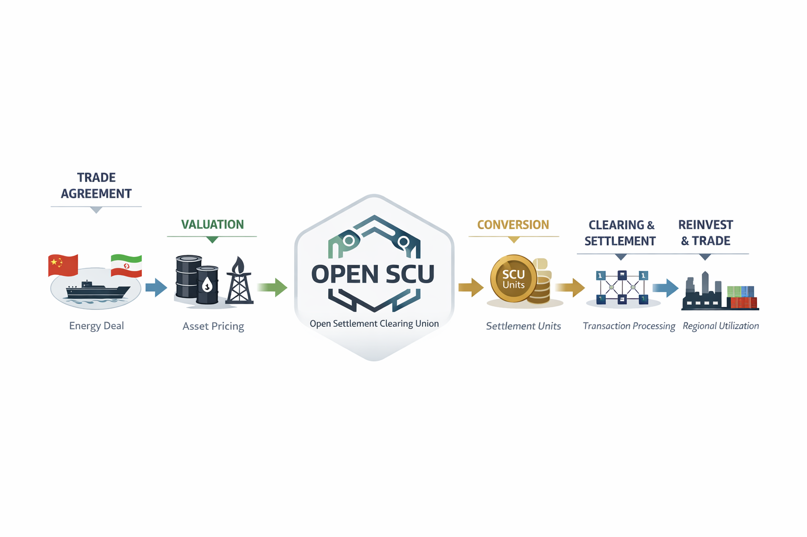

# OpenSCU
An Open, asset-referenced settlement infrastructure with transparent clearing engine and governance layer for regional and cross-border trade.

### Open Settlement Clearing Union

**Open-source infrastructure for asset-referenced trade settlement.**

---

## Overview

Open SCU is an open, neutral settlement layer designed to facilitate cross-border trade using real asset references instead of reliance on external financial systems.

It is not a currency.
It is not a token.

It is a **clearing and settlement framework**—built to enable regions, institutions, and participants to transact with greater transparency, resilience, and autonomy.

---

## The Problem

Global trade—particularly in energy and commodities—relies heavily on external settlement systems.

These systems introduce:

- Dependency on third-party financial infrastructure  
- Exposure to sanctions and access restrictions  
- Limited transparency in how value is cleared and settled  

Regions with significant real assets—energy, infrastructure, and production capacity—often lack control over how that value is exchanged.

---

## The Opportunity

Advances in distributed systems, data transparency, and open-source collaboration now make it possible to design a new kind of settlement infrastructure:

- Open and auditable  
- Neutral and non-sovereign  
- Anchored to real economic value  

---

## The Solution

Open SCU introduces a **Settlement Clearing Union model**, where:

- Trade is settled through a shared, transparent ledger  
- Value is referenced against a basket of real-world assets (e.g., energy)  
- No single party controls issuance, validation, or governance  

This creates a system that is:

- Verifiable by design  
- Resistant to unilateral control  
- Adaptable across regions and use cases  

---

## Core Principles

### 1. Open Source
All code, models, and mechanisms are publicly accessible and auditable.

### 2. Neutrality
No single nation, entity, or participant has unilateral control.

### 3. Asset Referencing
Settlement units are indexed to real-world assets, not abstract issuance.

### 4. Transparency
All settlement logic, flows, and governance processes are visible.

### 5. Modularity
The system can be adapted for regional or sector-specific implementations.

---

## System Architecture (High-Level)

Open SCU is composed of four primary layers:

### Settlement Engine
Handles clearing and reconciliation of trade between participants.

### Asset Index Layer
Defines how real-world assets (e.g., oil, gas) are referenced and weighted.

### Oracle System
Provides verified external data inputs (pricing, production, delivery).

### Governance Layer
Defines how decisions are proposed, validated, and implemented.

---

## What Open SCU Is Not

- Not a retail payment system  
- Not a speculative crypto asset  
- Not a replacement for existing currencies  

Open SCU operates alongside existing systems as a **parallel settlement infrastructure**.

---

## Getting Involved

We are building Open SCU as an open collaboration.

Contributors are welcome across multiple domains:

- Protocol & distributed systems development  
- Economic and monetary modeling  
- Energy markets and commodity analysis  
- Governance design  
- Documentation and research  

Start here:
👉 `/contributors/how-to-contribute.md`

---

## Current Focus

- Defining the initial asset reference model  
- Designing the settlement flow and clearing logic  
- Establishing oracle data standards  
- Drafting governance mechanisms  

---

## Disclaimer

Open SCU is an open research and development initiative.

It does not represent any government, institution, or financial authority.

Participation is voluntary, and all contributions are made in a transparent, open-source context.

---

## Vision

To create a globally accessible, transparent settlement infrastructure rooted in real economic value—

where trade is not constrained by access to external systems,  
but enabled by shared, verifiable frameworks.

## How It Works

*High-level flow of trade settlement through Open SCU’s neutral clearing layer.*
